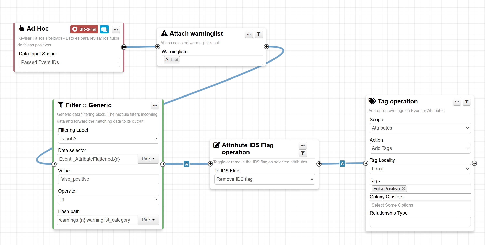
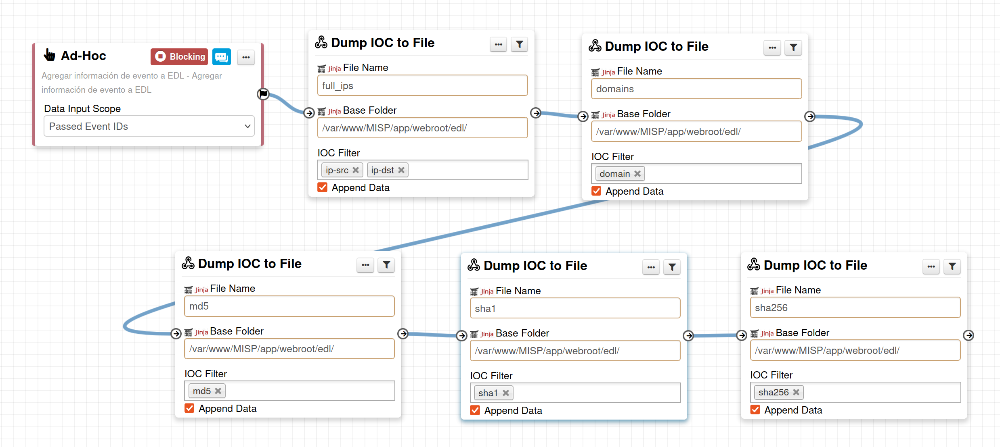

# My-MISP-Workflows

Estos son una serie de módulos para Workflows que estoy trabajando para la plataforma MISP (https://www.misp-project.org/)

Los Workflows son actividades que pueden automatizar tareas, principalmente de administración, que pueden ayudar a acelerar ciertos procesos "simples" como enriquecimiento de atributos.

Mi objetivo con esto es que podamos transformar esta plataforma de un agente pasivo en el ecosistema de Ciberseguridad a una plataforma activa (SOAR) que integre y distribuya toda la inteligencia que pueda acumular.

## Activar Workflows

Para activar los Worflows, hay que seguir la documentación (https://www.misp-project.org/misp-training/handout/a.12-misp-workflows_handout.pdf)

## Agregar los módulos

Los módulos son archivos .php que están en el repositorio y para agregarlos solo tienes que copiarlos dentro de la carpeta correspondiente (en una instalación por defecto sería: /var/www/MISP/app/Lib/WorkflowModules/action/).

Luego de eso se tienen que definir los módulos que lo usan, generalmente como módulos ad-hoc, y luego utilizarlos como te parezca mejor

## Crear Workflows con Blueprints

Los workflows se pueden modelar a través de plantillas (Blueprints) pre-armadas en formato JSON, que se pueden importar dentro de la plataforma directamente. Con esto te quedan bloques de flujo pre-configurados para poder integrar a los Workflows.

Por lo anterior estamos compartiendo los siguientes blueprints:

- [Revisar Falso Positivo](RevisarFalsoPositivo.json)

Este flujo busca simplemente contrastar los IOCs cargados con la listas blancas que tengas activado en el MISP (muy recomendado) y desactivar el toggle "to_ids" de los que calcen, y además marcarlos con un tag de "FalsoPositivo".

Esta es una buena práctica que se recomienda realizar tanto para un MISP que se use como SOAR como uno solamente de almacenamiento de información.

- [Agregar Información a EDL](AgregarInformacionEDL.json)

Este flujo lo que busca es que se agreguen los IOCs que necesitemos a unos archivos de texto que se van a usar como listas dinámicas (EDL o ETL). Estas listas se usan principalmente en Firewalls que quieren bloquear IPs o dominios, pero pueden ser útiles en multitud de herramientas.

**Este flujo requiere de uno de los módulos en el proyecto "Dump IOC 2 File"**
